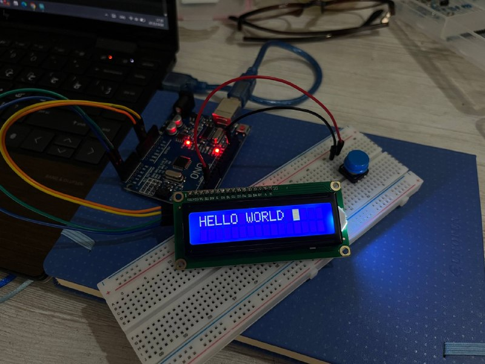
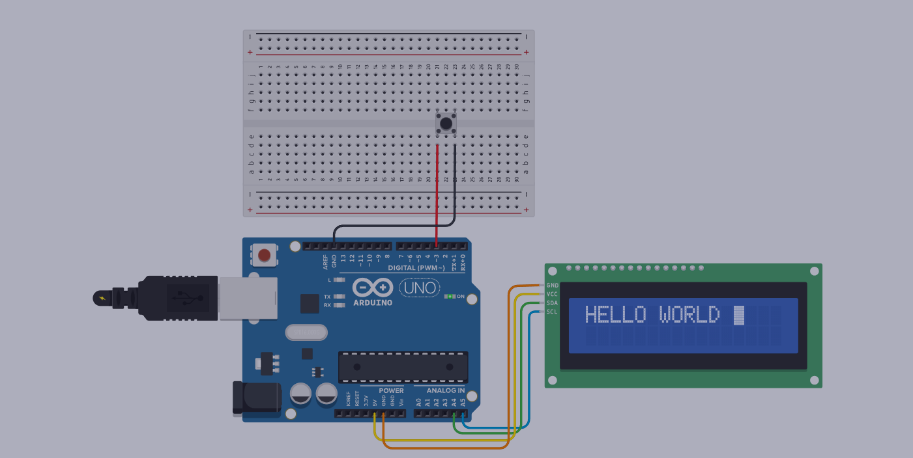

# ⭐ Morse Code Translator Using Arduino

  

  Translate Morse code into English using just a single push button.

## ✨ Overview

A simple Morse Code Translator built with Arduino that receives Morse input from a single push button and converts it into English characters displayed on a 16x2 I2C LCD.
The project is designed to simulate the behavior of a real Morse input device by using the duration of button presses to distinguish between dots and dashes, and timing gaps to detect the end of characters and words.

## ✨ Features

- Convert Morse code into English letters (A-Z)
- Detect dots (`.`) and dashes (`-`) based on button press duration
- Automatic character recognition using timing gaps
- Automatic word separation based on Morse timing standards
- Real-time LCD display
- Delete functionality using long button press
- Support for long texts with automatic scrolling behavior
- Non-blocking implementation using " millis() "

## ✨ Hardware Components

  

| Arduino UNO | Main microcontroller |
| 16x2 I2C LCD | Display output |
| Push Button | Morse input device |
| Breadboard | Circuit prototyping |
| Jumper Wires | Connections |

## ✨ Circuit Tinkercad Simulation

  

Tinkercad Simulation link:
> *(https://www.tinkercad.com/things/lhmKM8mP9Lx-morse-code-translator)*

# ✨ Demonstration

## ❓ How It Works?

The application is divided into independent modules:
`readButton()` Reads the push button and determines dot, dash, or delete
`decodeMorse()` Converts Morse sequences into letters
`checkCharacterGap()` Detects the end of a character
`checkWordGap()` Detects the end of a word
`deleteLastChar()` Removes the last Morse symbol or translated character
`refreshLCD()` Updates the LCD display 

## Typing & Character Recognition

  

The entered Morse symbols are displayed immediately. After a short pause, they are automatically replaced with the corresponding English letter.

## Delete Function

  

Holding the button longer removes the most recent input, allowing quick correction while typing.

## Automatic Scrolling

  

When the translated message exceeds the LCD width, the display automatically scrolls to keep the latest characters visible.

## ✨ Technologies Used

- Arduino C++
- I2C Communication
- LCD Interface
- Embedded Timing Techniques
- Event-based Programming
- State Machine Concepts

## 🛠️ Future Improvements

Possible improvements:
- Add numbers and punctuation support
- Create a graphical user interface using PyQt
- Store translated messages in memory

## ✨ Author & License

**Parnian Ghorbani**

This project is open-source and available for learning and educational purposes however; If you use this project or its ideas in your own work, please consider mentioning this repository :)
